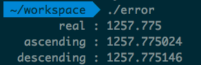
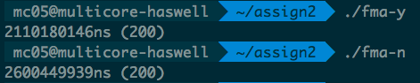
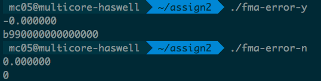

Multicore Computing HW#2
========
2013-11392 김지현

1. 계산 순서와 부동 소수점 오차
--------
13개의 수들을 단정밀도 부동소수점 포맷으로 저장하여 더해보았다. 숫자들은 덧셈
결과의 참값을 자명하게 알 수 있도록 소수점 자릿수가 적은 유리수들을 사용하였다.



계산방법 | 덧셈 결과     | Round-off error
---------|---------------|-----------------
참값     | `1257.775`    |
오름차순 | `1257.775024` | `0.000024`
내림차순 | `1257.775146` | `0.000146`

위와같이, 오름차순으로 계산하였을때 더 적은 Round-off error가 발생하였다.

위와같은 결과가 발생한 이유는, 내림차순으로 계산할경우 작은 수들의
낮은자리수들이 모두 Round-off 되어버리기때문에 오차가 큰 반면, 오름차순으로
계산할경우 낮은자리수들이 덜 Round-off 되어서, 내림차순으로 계산했었다면 없었을
수들의 계산결과가 총합에 반영이 되기때문이다.

2. FMA
--------
### Performance
FMA3 instruction의 성능을 측정하기위한 수식으로, `512*1024*1024`차 식의 계산을
사용하였다. 계산에는 단정밀도 부동소수점을 사용하였고, 수행한 연산은 아래와
같았다.
```
( ... (((1.1*0.95 + 10)*0.95 + 10)*0.95 + 10)*0.95 ... + 10)*0.95 + 10
```
계산 결과는 `200`으로 수렴되지만, 다행히도 `gcc`는 위 연산을 최적화시켜서 없애지
않았다. `gcc` 명령어에 `-mfma` 옵션을 준 결과, 계산을 수행하는 어셈블리 코드가
아래와 같이 변화한것을 볼 수 있었다.
```asm
# before
mulsd  xmm0,xmm3
addsd  xmm0,xmm2
# after
vfmadd132sd  xmm0,xmm2,xmm3
```
이 외에도 `float`와 연관된 많은 코드가 최적화 되어있었다. 실행시간을 비교한결과
아래와 같았다.



With FMA      | Without FMA
--------------|-------------
2110.180146μs | 2600.449939μs

### Accuracy
일상적인 상황에선 정확성에 차이가 나지 않았으나, 아래와같이 오차가 나기 쉬운
계산의 경우, 확연한 차이가 발생하였다.
```
ε = 2**-51 (small value)
(1 + ε)(1 - ε) - 1 = fma(1 + ε, 1 - ε, -1) = -ε²
```
위 계산을 배정밀도 부동소수점으로 수행하고, FMA를 쓴것과 쓰지않은것을 비교한결과
아래와 같은 결과를 얻었다.



Method       | Hex value of result  | Value
-------------|----------------------|-----------
With FMA     | `0xb990000000000000` | `2**-102`
Without FMA  | `0x0000000000000000` | `0.0`

FMA를 사용한경우 정확히 참값이 나오고, FMA를 쓰지 않은경우 Round-off되어 0이
된것을 볼 수 있다. 이는 FMA를 쓰지 않으면 `(1 + ε)(1 - ε)`의 계산결과인 `1 -
ε²`를 레지스터에 저장해야하는데, 단독 `-ε²`는 exponent를 줄여서 표기할 수
있지만, `1 - ε²` 를 레지스터에 저장하기에는 fragment에 허용된 자리수가 많지
않기때문에 Round-off 되버러기디 때문이다.
