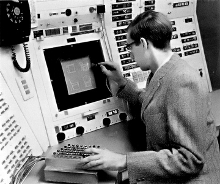

Sketchpad
========
2013-11392 컴퓨터공학과 김지현

21세기 정보과학혁명의 시대, 우리는 컴퓨터에 둘러싸여서 살고있다. 사람들의
주머니와 손에 스마트폰이라는 컴퓨터가 한대씩, 책상에 노트북과 데스크톱이라는
이름으로 한대씩. 컴퓨터공학과인 나는 말할것도 없으며, 그림이나 만화를 그리는
사람들도 캔버스 앞보다 컴퓨터 앞에 앉아있는 사람이 더 많고, 컴퓨터가 우리 생활을
얼마나 편하게 해주는지는 더 설명할 필요가 없다.

그러나 우리가 교과서로 볼 수 있는 옛 컴퓨터들의 모습은 우리의 컴퓨터에 대한
인식과는 거리가 있다. 그당시의 컴퓨터는 사람의 생활을 편하게 해주는 기계, 누구나
가지고 놀 수 있는 재미난 장난감이 아닌, 컴퓨터공학을 전공한 과학자 수학자들만이
다룰 수 있는 아주 어려운 기계장치였다. '계산기'라는 뜻의 컴퓨터라는 이름에서도
알 수 있듯이, 컴퓨터의 초기 개발 목적은 암호해석이나 로켓의 탄도 계산과 같은
수학·군사적인 용도가 주였다. 이후 트랜지스터 기술의 발달로 컴퓨터의 크기가
작아졌다고는 해도, 컴퓨터는 긴 시간동안 프로그래머와 전문가들의 전유물이었다.
컴퓨터를 일반인들도 쓰기 편하게 만들으려는 시도의 시작엔 누가 있을까? 그곳엔
바로 Ivan sutherland와 Sketchpad가 있다.

Sketchpad는 최초로 사람이 실제 세상과 심리스(seamless)하게 상호작용할 수 있는
프로그램이며 1962년 Ivan sutherland에 의해 발명되었다. Ivan sutherland는 어려운
입력장치나 프로그래밍 지식을 익히지 않아도 일반인들이 컴퓨터를 쓸 수 있게 하길
원했으며, 서덜랜드는 키보드 대신 이미 사람들이 일상적으로 쓰고있는 펜이나 종이와
같은 도구를 컴퓨터에 대해서도 쓸 수 있게 하려고 시도하였다.

Sutherland는 Sketchpad를 이용해 대중들에게 컴퓨터로 그림을 그리고 제품을
설계하는것을 시연하였고, 단순히 컴퓨터로 종이와 펜을 재현하는것을 넘어서 기존의
펜과 종이로는 하기 힘든 작업들을 컴퓨터로 어떻게 쉽게 이룩하는지 보였다.
Sketchpad를 이용해 사람들은 자나 각도기를 대지 않고 편하게 선을 직선·직각으로
그릴 수 있었고, 이미 그린 선을 지우지 않고 쉽게 변형시킬 수 있었고, 일일이
길이를 재지않고 편하게 점선을 그을 수 있었다.

교과서에 나오는 Ivan Sutherland는 위와같은 업적들로 단순히 컴퓨터그래픽스의
창시자, 3D 모델링과 가상현실의 선구자로 평가받지만 나는 서덜랜드를 컴퓨터를
텍스트 인터페이스의 장벽을 넘어, 일반에게 보급하려고 한 선구자로 본다.

Sutherland의 Sketchpad는 단순한 편한 그림도구에서 멈추지 않고, 그래픽스라는
학문의 방향성을 바꿔놓았다. 컴퓨터로는 단순한 계산만 할 수 있다는 생각을 갖고있던
사람들에게 Sketchpad는 엄청난 충격이었고, 이후 컴퓨터는 어떻게하면 대중에게
보급될 수 있을지, 어떻게 하면 일반인들도 편하게 컴퓨터를 쓸 수 있을지의 방향으로
발전하기 시작한다.

'누가 소프트웨어의 심장을 만들었는가'(박지훈 저)는 Ivan Sutherland를 최초로
컴퓨터와 사람 사이의 간극을 그래픽으로 메꾼 사람으로 규정한다. Sutherland
이전에도 컴퓨터그래픽스라는 학문은 존재했지만, Sutherland 이전의 그래픽스는 그저
컴퓨터로 이미지를 계산하여 만들어내고, 그래프를 그리는 정도의 역할에 그쳤었다.
하지만 Sutherland 이후의 그래픽스연구엔 항상 Interactive 라는 단어가
따라붙게되었고, 텍스트 기반이 아닌 마우스와 그림으로 이뤄진 GUI가
탄생하게 된것이다.

Sutherland는 처음으로 대중을 위한 어플리케이션을 만들었다고도 할 수 있다.
서덜랜드 이전의 응용프로그램 개발은 이미 프로그래밍을 할 줄 아는 사람들이
프로그래밍을 더 편하게 하기위해 개발된것이 대부분이었다. 하지만 Sketchpad는
컴퓨터를 아예 모르는 일반인들도 쉽게 쓸 수 있도록 '디자인'되었으며, 특별한
교육을 거치지 않아도 이미 알고있는 종이와 펜으로 그림을 그리듯이 프로그램을 쓸
수 있도록 하였다. 이러한 관점에서 보면 Sketchpad는 처음으로 UX의 개념을 고려하여
만들어진 프로그램이라고 할 수 있겠다.

Sutherland는 이후로도 새로운 학문을 계속하여 개척하였다. 그래픽스 연구를
계속하여 3D 그래픽스 학문을 개척하기도 했고, 정말 놀랍게도 1960년대라는 그
컴퓨터 역사의 초기에 헤드마운트 디스플레이를 발명하였고, 서덜랜드는 컴퓨터
그래픽스에 남긴 업적들을 인정받아 1988년 튜링상을 수상하였고, 지금도 연구를
계속하고있다.
