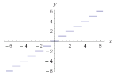
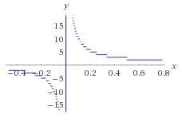
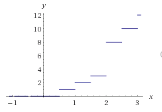
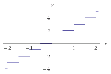
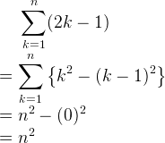
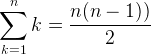
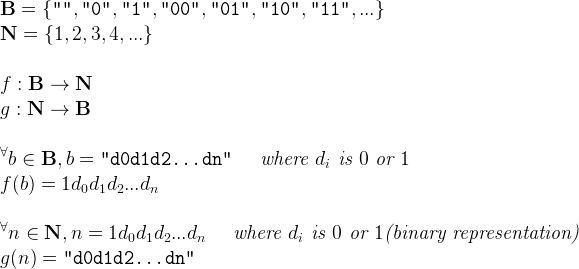
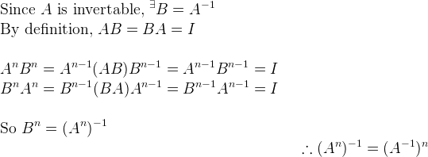
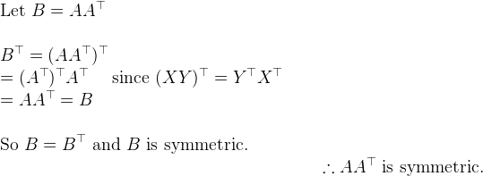

Homework 2
--------
> Sets, Functions, Sequences, Sums, and Matrices

<p align=right>컴퓨터공학부 2013-11392 김지현</p>

#### 1.
a) The square of a real number is never -1. **True**

b) There is an integer whose square is 2. **False**

c) The square of all integer is positive. **False**

d) There is a real number which is equal to its own square. **True**

#### 2.
a) **Z<sup>+</sup>**

b) **∅**

c) **Z - { 0, 1 }**

#### 3.
`A - B` means set containing those elements in A but not in both A and B.

`B - A` means set containing those elements in B but not in both A and B.

So, `(A - B) ∪ (B - A)` should mean set containing those elements in either A or
B, but not in both A and B.

#### 4.
> A = { a, a, a, b, b, c }
> <br>
> B = { a, a, b, b, b, c, c, c, c }

a) **{ 3•a, 3•b, 4•c }**

b) **{ 2•a, 2•b, c }**

c) **{ a }**

d) **{ b, 3•c }**

#### 5.
```
y = (f ◦ g)(x) = f(g(x)) = f(cx + d) = a(cx + d) + b = acx + ad + b
y = (g ◦ f)(x) = g(f(x)) = g(ax + b) = c(ax + b) + d = acx + cb + d

ad + b = cb + d
```
`ad + b = cb + d`를 만족하는 constant a, b, c, d는 `f ◦ g = g ◦ f`를 성립시킨다.

#### 6.
a)<br>

b)<br>

c)<br>

d)<br>

#### 7.
a) **True** since `⌊x⌋` is already an integer, `⌈⌊x⌋⌉` will always be same with `⌊x⌋`.

b) **False**. If `x = 0.6`, `⌊2x⌋ = ⌊1.2⌋ = 1` and `2⌊x⌋ = 2⌊0.6⌋ = 0`

c) **False**. If `x = y = 0.5`, `⌈x⌉ + ⌈y⌉ - ⌈x + y⌉ = ⌈0.5⌉ + ⌈0.5⌉ - ⌈1.0⌉ = -1 ≠ 0`

#### 8.
a)<br>

<!--

<latex>
     \sum_{k=1}^n (2k-1)
\\ = \sum_{k=1}^n \left \{ k^2-(k-1)^2 \right \}
\\ = n^2-(0)^2
\\ = n^2
</latex>

-->

b)<br>

<!--
<latex>\sum_{k=1}^n k = \frac{n(n-1))}{2}</latex>
-->

#### 9.
a) **Countably infinite**. `{ 1, 2, 4, 5, ... }`

b) **Countably infinite**. `{ 5, 10, 15, 20, 25, 30, 40, 45, ... }`

c) **Countably infinite**. `{ 1, 1.1, 1.11, 11.1, 1.111, 11.11, 111.1, ... }`

d) **Countably infinite**. `{ 1, 9, 1.1, 9.9, 1.11, 9.99, 11.1, 99.9, ... }`

#### 10.
The set of all finite bit strings **B** and the set of natural numbers **N**
have the same cardinality since there is a one-to-one correspondence from **B**
to **N**.

> 

<!--

\\ \bold{B} = \left \{  \texttt{""}, \texttt{"0"}, \texttt{"1"}, \texttt{"00"}, \texttt{"01"}, \texttt{"10"}, \texttt{"11"}, ... \right \}
\\ \bold{N} = \left \{ 1, 2, 3, 4, ... \right \}
\\
\\ f : \bold{B} \rightarrow \bold{N}
\\ g : \bold{N} \rightarrow \bold{B}
\\
\\ ^\forall b \in \bold{B}, b = \texttt{"d0d1d2...dn"} \quad \textit{ where } d_i \textit{ is } 0 \textit{ or } 1
\\ f(b) = 1d_0d_1d_2...d_n
\\
\\ ^\forall n \in \bold{N}, n = 1d_0d_1d_2...d_n \quad \textit{ where } d_i \textit{ is } 0 \textit{ or } 1 \textit{(binary representation)}
\\ g(n) = \texttt{"d0d1d2...dn"}

-->

#### 11.


<!--

\\ \textup{Since } A \textup{ is invertable, } ^\exists B = A^{-1}
\\ \textup{By definition, } AB = BA = I
\\
\\ A^nB^n = A^{n-1}(AB)B^{n-1} = A^{n-1}B^{n-1} = I
\\ B^nA^n = B^{n-1}(BA)A^{n-1} = B^{n-1}A^{n-1} = I
\\
\\ \textup{So } B^n = (A^n)^{-1}
\flushright \therefore (A^n)^{-1} = (A^{-1})^n

-->

#### 12.


<!--

\\ \textup{Let } B = AA^\top
\\
\\ B^\top = (AA^\top)^\top
\\ = (A^\top)^\top A^\top \quad \textup{ since } (XY)^\top = Y^\top X^\top
\\ = AA^\top = B
\\
\\ \textup{So } B = B^\top \textup{ and } B \textup{ is symmetric.}
\flushright
\therefore AA^\top \textup{ is symmetric.}

-->
