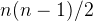
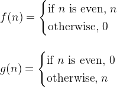
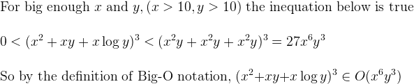

Homework 3
--------

<p align=right>컴퓨터공학부 2013-11392 김지현</p>

#### 1.

```rust
// 최소값을 찾을 배열이 아래와 같다고 하자
let numbers = [ n1, n2, n3, ... , nk ];

let min = n1;
for n in numbers {
    if (n < min) { min = n; }
}
```

#### 2.


#### 3.

<!--

\\

f(n) = \begin{cases}
   \textup{if } n \textup{ is even, } n
\\ \textup{otherwise, } 0
\end{cases}

\\
\\
\\

g(n) = \begin{cases}
   \textup{if } n \textup{ is even, } 0
\\ \textup{otherwise, } n
\end{cases}

-->

#### 4.

<!--

\\ \textup{For big enough } x \textup{ and } y, ( x > 10, y > 10 ) \textup{ the inequation below is true}
\\
\\ 0 < (x^2 + xy + x \log y)^3 < (x^2y + x^2y + x^2y)^3 = 27x^6y^3
\\
\\ \textup{So by the definition of Big-O notation, } (x^2 + xy + x \log y)^3 \in O(x^6y^3)

-->

#### 5.
> 문제의 log는 모두 밑이 10이라고 가정하였다.c

a) log n = 10^6, n = 10^1000000

b) n = 10^6

c) n log n = 10^6, n ≈ 1.8 * 10^5

> 어차피 log(n)은 별로 안변하니, 11정도로 고정하고 풀면 된다.

n = 10^6 / 20 = 5 * 10^4

d) n^2 = 10^6, n = 10^3

e) 2^n = 10^6, n ≈ 20

f) n! = 10^6, n ≈ 9.5

#### 6.


O(log n) 이다. 이진탐색을 하면, 최악의 경우일지라도 무조건 한번에 남은 경우의
수를 반개씩 줄여가면서 탐색을 하기 때문이다.
